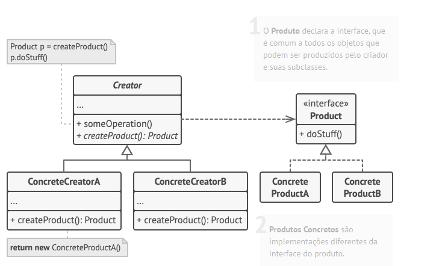
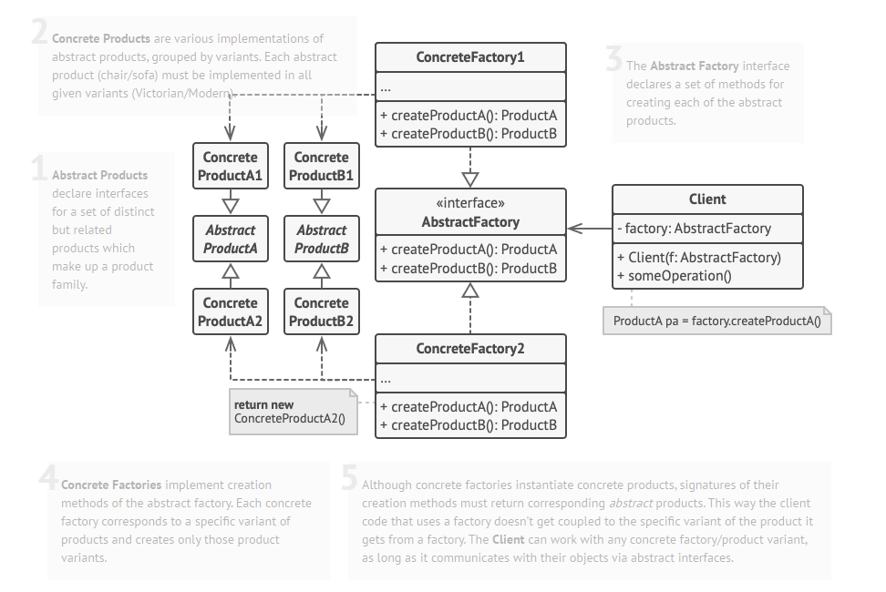
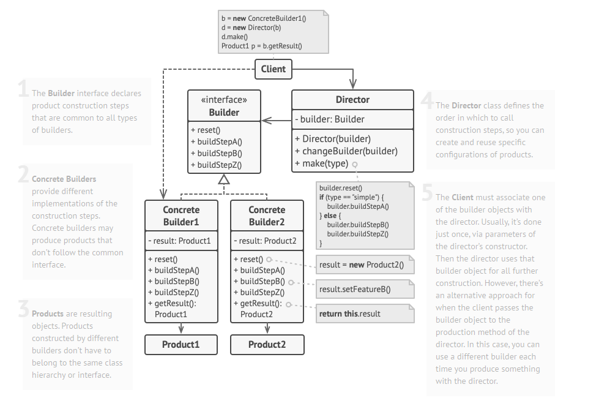
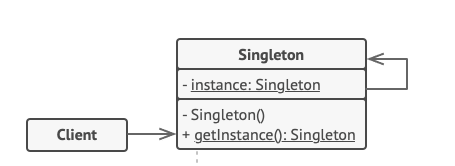
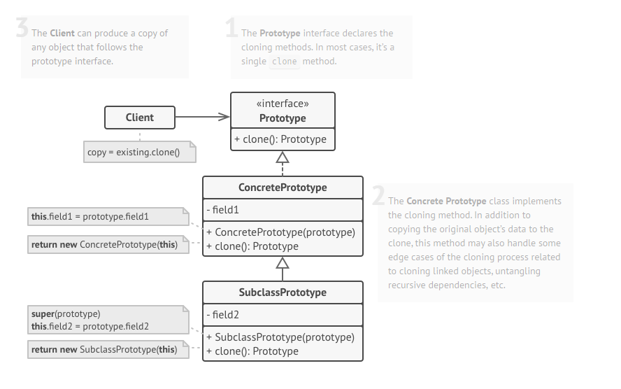
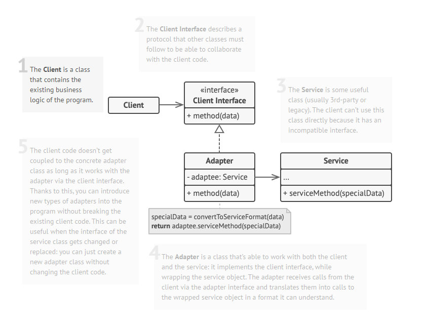

This repository was created for self learning purpose.
- References: 
  - [Refactoring Guru](https://refactoring.guru/)
  - [Geekific Youtube Channel](https://www.youtube.com/watch?v=mE3qTp1TEbg&list=PLlsmxlJgn1HJpa28yHzkBmUY-Ty71ZUGc)


## #  Creational
### 1 - Factory Method:
#### It solves the problem of creating product objects without specifying their concrete classes.
#### A design pattern that provides an interface for creating objects in a superclass, but allows subclasses to alter the type of objects that will be created.

- The factory Method relies heavily on inheritance.
- Use it, if you have no idea of the exact types of the objects your code will work with.
- Makes it easy to extend the product construction code independently of the rest of the application.
- Allows introducing new products without breaking existing code.
- With that, you can reach OCP and SRP principles.



### 2 - Abstract Factory Method:
#### A design pattern that lets you produce families of related objects without specifying their concrete classes.

- Use it, when your code needs to work with various families of related products.
- Many designs start by using the Factory Method Pattern and latter evolve toward an Abstract Factory Design.
- With that, you can reach OCP and SRP principles.


### 3 - Builder:
#### A design pattern that lets you construct complex objects step by step. The pattern allows you to produce different types and representations of an object using the same construction code.

-  If you create several instances for one specific class using the builder that can have some similarities you can have a director class. For example:
```
Car car = new CarBuilder()
    .id(2122)
    .brand("Bugatti")
    .model("Chiron")
    .color("Blue")
    .nbrDoors(2)
    .engine("8L")
    .builder();
    
    Car car = new CarBuilder()
    .id(2123)
    .brand("Bugatti")
    .model("Chiron")
    .color("RED")
    .nbrDoors(2)
    .engine("8L")
    .builder();
    
    Car car = new CarBuilder()
    .id(2124)
    .brand("Bugatti")
    .model("Chiron")
    .color("Brown")
    .nbrDoors(2)
    .engine("8L")
    .builder();
```
- This repeatable series of calls and steps the builder is using should be extract to a separate class called DIRECTOR.
- Director class defines thr order in which we should call the construction steps, so that we can reuse specific configurations of the products we are building (See builder package).
- Director hides the details of the product construction from the client code.
- Having a director class in your program isn’t strictly necessary. You can always call the building steps in a specific order directly from the client code. However, the director class might be a good place to put various construction routines so you can reuse them across your program.
- In addition, the director class completely hides the details of product construction from the client code. The client only needs to associate a builder with a director, launch the construction with the director, and get the result from the builder.


### 4 - Singleton:
#### A design pattern that lets you ensure that a class has only one instance while providing a global access point to this instance.

### 5 - Prototype:

#### A design pattern that lets you copy existing objects without making your code dependent on their classes. It delegates the object duplication or cloning process to the actual objects that are being cloned.
 
- All prototype classes should have a common interface that makes it possible to copy objects even if their concrete classes are unknown. Prototype objects can produce full copies since objects of the same class can access each other’s private fields.
- The pattern declares a common interface for all objects that support cloning. This interface lets you clone an object without coupling your code to the class of that object. Usually, such an interface contains just a single clone method.





## # Structural

### 1 - Adapter
- Allows objects with incompatible interfaces to collaborate.
- An adapter wraps one of the objects to hide the complexity of conversion happening behind the scenes. The wrapped object isn’t even aware of the adapter. For example, you can wrap an object that operates in meters and kilometers with an adapter that converts all of the data to imperial units such as feet and miles.
- Adapter allows to reuse existing coding without changing it, as the adapter ensures the conversion between the different interfaces.
- Uses inheritance and composition to enable objects with incompatible interfaces to collaborate with one another.
- It creates a middle-layer class that serves as a translator.

