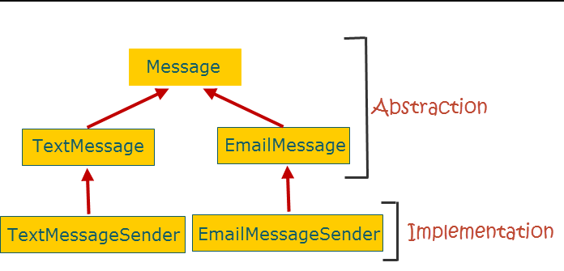
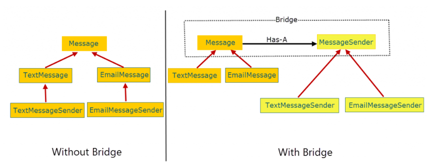

Reference: https://springframework.guru/gang-of-four-design-patterns/bridge-pattern/ 

### Problem:
- To understand how the bridge pattern works, consider a messaging application that clients can use to send different types of messages, such as a text or an email message. The most intuitive approach is to first create an interface or an abstract base class, Message. Next, we create the derived classes: TextMessage and EmailMessage. Finally, to send messages, we create two message sender classes: TextMessageSender that extends TextMessage and EmailMessageSender that extends EmailMessage. This is how our inheritance hierarchy looks like.

- At first sight, there appears nothing wrong in the design above. But if you look deep you will notice that the abstraction part- the part that clients interact with, and the implementation part- the part that provides the core functionality of sending messages, are tightly integrated. Our design relies on inheritance and one inherent disadvantage is that it breaks encapsulation. As a developer of the EmailMessageSender subclass, you have to know about the internals of the EmailMessage superclass, which means the encapsulation in the superclass is broken.

- Our design is also fragile. As an example, if we change the implementation to allow clients to optionally encrypt the message before sending, we will need to update the abstraction part to make the encryption functionality available to clients.

- Another issue is reusability. If we want to reuse only the implementation (message sending) part in some other application, we will have to take along the abstraction part as extra baggage.

- The bridge pattern addresses all such issues by separating the abstraction and implementation into two class hierarchies. This figure shows the design without and with the bridge pattern.

### Solution:
