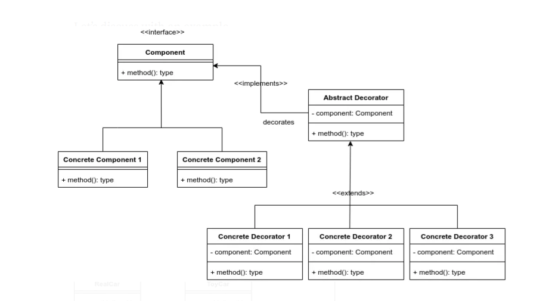

Reference: https://salithachathuranga94.medium.com/decorator-design-pattern-in-java-1b0931ead0e4

### Problem:
- We are going to assemble a Car with some functionalities such as Luxury mode, Sports mode and Paints. So we can create a real car and even a toy car basically in this setup. We just need to add the functionalities. If we design this using a simple UML diagram, it will be like this exactly.

 