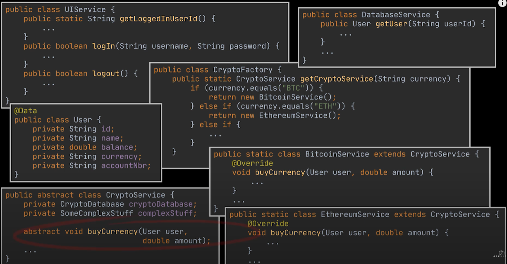
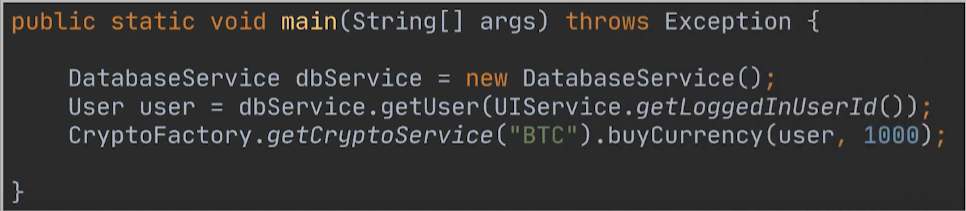

### Problem:
- You are working in a Crypto App. this application allow clients to buy, sell and store crypto, and you are going to use a 3rd party library
- This library offers a wide range of options, methods, interfaces

  

- You want to reuse the buyCurrency method offered by this library

  

- You can go ahead, and directly call the method provided by this library. However, what if this code is needed by other parts of the application.
- We would duplicate this code. Moreover, if the requirements change, we need to perform the changes along the code.
- This makes our business logic tightly coupled to the implementation details of the third-party classes, and hard to comprehend and maintain.

- So, we need a centralized place to put all the logic inside it, to center it, and to restrict direct access to the inner workings of the library.
