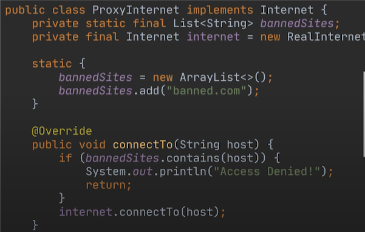

### Problem 1:

- Suppose that we have a class called Internet, and everytime that a user tries to connect a particular website, heshe can create an instance of that class, connect to a connect method and it is done.

- Now, a new requirement is to restrict access to a couple of websites, however if we restrict to access to these website through the internet class, no one will be able to access it

- We need a kind of intermediate server, a proxy, that checks the user request among a list of banned websites.

### Problem 2:

- We have a video download class, where we have a method to download the video. This method connect to youtube, download the video, retrieve video metadata and return the video.

- However, everytime we need a particular video, that video will be get downloaded over again, even if was previously downloaded.
- To avoid this, we need to cache the info of downloaded videos. Always, our proxy class will be implementing the same interface as our concrete class.

